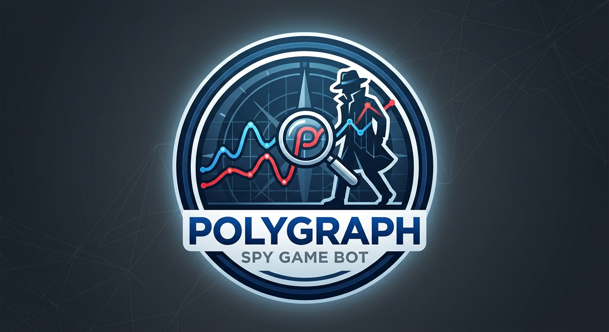
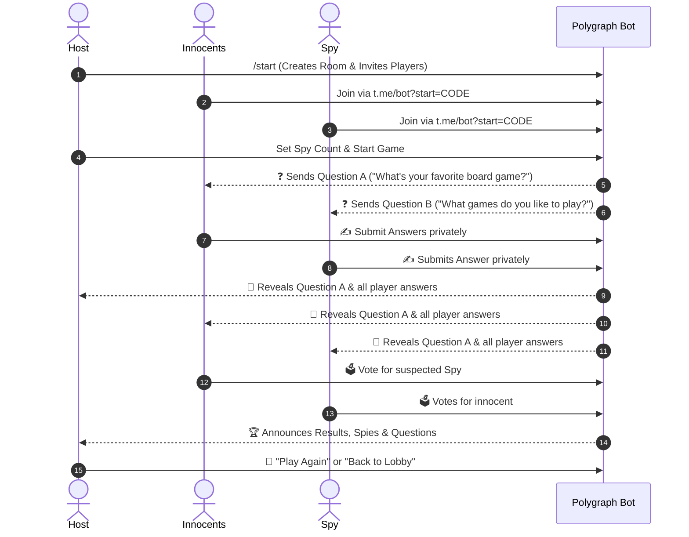

# 🕵️‍♂️ Polygraph — Multiplayer Spy Game Telegram Bot



**Polygraph** is a multiplayer party game bot for Telegram (inspired by the classic Spyfall / "Знахідка для шпигуна" mechanics).

Players join a shared room via an invite link. In each round, innocent players receive a **Main Question** (Question A), while the secret spy receives a subtly different **Spy Question** (Question B). Everyone submits their answers privately to the bot. Once all answers are collected, the bot reveals the main question along with all submitted answers. Players then discuss and vote to unmask and kick the spy!

---

## 🎮 Game Rules & Flow



1. **Room Lobby**: Host creates a room and shares the generated deep link (`t.me/<bot_username>?start=<ROOM_CODE>`).
2. **Spy Count Configuration**: The host can choose how many spies will be in the game ($1 \le \text{spies} < \text{player count}$).
3. **Private Question Distribution**:
   - **Innocents** receive the main question (Question A).
   - **Spy(ies)** receive a related question (Question B) without knowing they are the spy!
4. **Answer Collection**: Players send their answers via private messages to the bot.
5. **Reveal Phase**: The bot publishes the main question and the numbered list of answers with player names.
6. **Voting**: Players vote using inline buttons. If the majority votes out the spy, **Innocents win**; if an innocent is kicked or there is a tie, the **Spy wins**!
7. **Rematch & Session Non-Recurrence**: The host can instantly start a rematch with the same players. Used questions will never recur during the room's session.

---

## ✨ Features

- 🔗 **Deep-Link Room Creation**: Instant one-click join via Telegram deep-links.
- 📂 **Dynamic CSV Question Pool**: Just drop `.csv` files into the `assets/` folder to add more question packs without changing code.
- 🚫 **No Repeated Questions**: Session-level tracking guarantees questions do not repeat during a room's active session.
- ⚙️ **Host Management**: Configure spy counts, kick inactive players, and trigger rematches.
- ⚡ **Asynchronous & Fast**: Powered by `aiogram 3.x` and Python 3.12.
- 🐳 **Docker & Kubernetes Ready**: Lightweight multi-stage container build and production k8s manifests.
- 🧪 **Fully Tested**: Domain models, question parsers, room state machines, and message formatters tested with `pytest` (TDD).

---

## 📁 Project Structure

```text
polygraph/
├── assets/                               # CSV question files
│   ├── spy_questions_hobbies.csv
│   └── spy_questions_relationships.csv
├── k8s/                                  # Kubernetes deployment manifests
│   ├── deployment.yaml
│   ├── configmap.yaml
│   ├── secret.yaml.template
│   └── README.md
├── src/
│   ├── config.py                         # Environment configuration
│   ├── main.py                           # Application entrypoint & bot runner
│   ├── bot/
│   │   ├── keyboards.py                  # Inline keyboards (Lobby, Spy Count, Voting, Rematch)
│   │   ├── messages.py                   # UI messages & rich text formatting
│   │   └── handlers/
│   │       ├── common.py                 # /start, deep-links, /rules
│   │       ├── lobby.py                  # Room creation, spy config, kicking, starting
│   │       ├── gameplay.py               # Answer collection & reveal
│   │       └── voting.py                 # Vote handling, results, rematch
│   └── game/
│       ├── models.py                     # Player, GamePhase, GameResult dataclasses
│       ├── questions.py                  # Dynamic CSV scanner & question pairing
│       ├── room.py                       # Room lifecycle state machine
│       └── manager.py                    # Global room registry & lookup
├── tests/                                # Test suite
│   ├── test_questions.py
│   ├── test_room.py
│   ├── test_manager.py
│   └── test_messages_keyboards.py
├── .github/workflows/ci.yaml             # CI/CD pipeline
├── Dockerfile                            # Multi-stage container build
├── Makefile                              # Development & testing shortcuts
└── pyproject.toml                        # Project dependencies & tool configs
```

---

## 🚀 Getting Started

### Prerequisites
- Python 3.12+
- [uv](https://docs.astral.sh/uv/) (recommended) or standard `pip`
- A Telegram Bot Token from [@BotFather](https://t.me/BotFather)

### 1. Installation

Clone the repository and install dependencies:

```bash
git clone https://github.com/PiterPentester/polygraph.git
cd polygraph

# Install dependencies using uv
make deps
# or directly:
uv sync
```

### 2. Configuration

Create a `.env` file in the project root:

```env
BOT_TOKEN=123456789:ABCdefGHIjklMNOpqrSTUvwxYZ
LOG_LEVEL=INFO
ASSETS_DIR=assets
```

### 3. Run Locally

```bash
make run
# or
uv run python src/main.py
```

---

## 📝 Adding New Question Packs

You can add new categories by placing any `.csv` file into the `assets/` folder. The bot automatically detects and loads them on startup.

### Supported CSV Formats:

#### Format 1: Single Thematic Questions (Default)
File: `assets/spy_questions_movies.csv`
```csv
id,питання
1,Який твій улюблений фільм?
2,Який серіал ти дивився останнім?
3,Який жанр кіно тобі найбільше подобається?
```
*(The bot pairs related questions within the same category for innocents vs spies).*

#### Format 2: Explicit Pairs
File: `assets/spy_questions_food.csv`
```csv
main_question,spy_question
Яка твоя улюблена страва?,Який твій улюблений напій?
Де ти зазвичай снідаєш?,Що ти зазвичай їси на вечерю?
```

---

## 🧪 Testing & Quality Assurance

Run code formatting, linting, security scans, and test suite:

```bash
# Run all checks (format, lint, security scan, tests)
make check

# Run tests only
make test

# Format code
make format

# Lint code
make lint
```

---

## ☸️ Kubernetes Deployment

1. **Create the Secret with your bot token**:
   ```bash
   kubectl create secret generic polygraph-secrets \
     --from-literal=BOT_TOKEN="your_telegram_bot_token"
   ```

2. **Apply Kubernetes resources**:
   ```bash
   kubectl apply -f k8s/configmap.yaml
   kubectl apply -f k8s/deployment.yaml
   ```

3. **Verify running pod**:
   ```bash
   kubectl get pods -l app=polygraph-bot
   kubectl logs -f -l app=polygraph-bot
   ```

For more details on Kubernetes deployment, see [k8s/README.md](file:///Users/ckayt/Projects/polygraph/k8s/README.md).

---

## 📄 License

This project is licensed under the MIT License.
